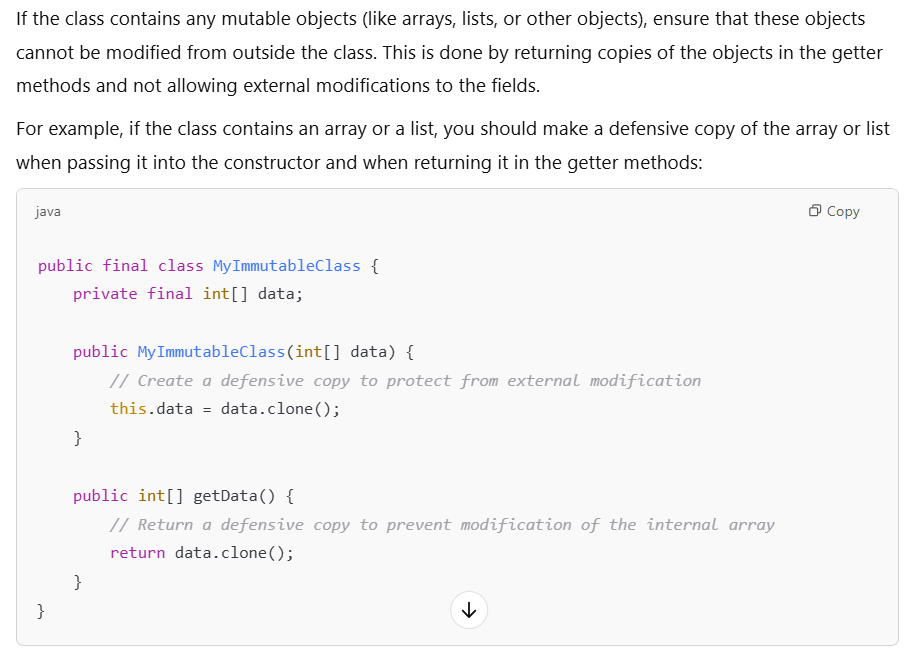

1. How do you ensure that the class is immutable;
Ans - 
   1. Declare class as final
   2. Make All field private and final
   3. Initialize all field in the constructor
   4. Provide only getter method(no setter) 
   5. If fields are mutable objects (like arrays or collections), make them defensive
   
Why immutability is important:
   **Thread Safety**: Immutable objects are naturally thread-safe because their state cannot change after they are created, so you don’t have to worry about synchronization when accessing them.
   **Reliability**: Once an immutable object is created, you can be sure its state will never change, making it easier to reason about and less error-prone.
   **Hashing and Caching**: Immutable objects are often used as keys in hash maps or for caching because they can be reliably used in hash-based collections without risk of their state changing.
2. what is immutable;
3. Diff between @Bean and @Service
4. Diff between @Service and @Repository
5. Write code for singleton pattern
6. Write code for builder design pattern
7. What is the Bean life cycle
Ans - 
   **Container Started**: The Spring IoC container is initialized.
   **Bean Instantiated**: The container creates an instance of the bean.
   **Dependencies Injected**: The container injects the dependencies into the bean.
   **Custom init() method**: If the bean implements InitializingBean or has a custom initialization method specified via @PostConstruct or init-method.
   **Bean is Ready**: The bean is now fully initialized and ready to be used.
   **Custom utility method**: This could be any custom method you have defined in your bean.
   **Custom destroy() method**: If the bean implements DisposableBean or has a custom destruction method specified via @PreDestroy or destroy-method, it is called when the container is shutting down.
8. What all annotation you have used in spring boot.
